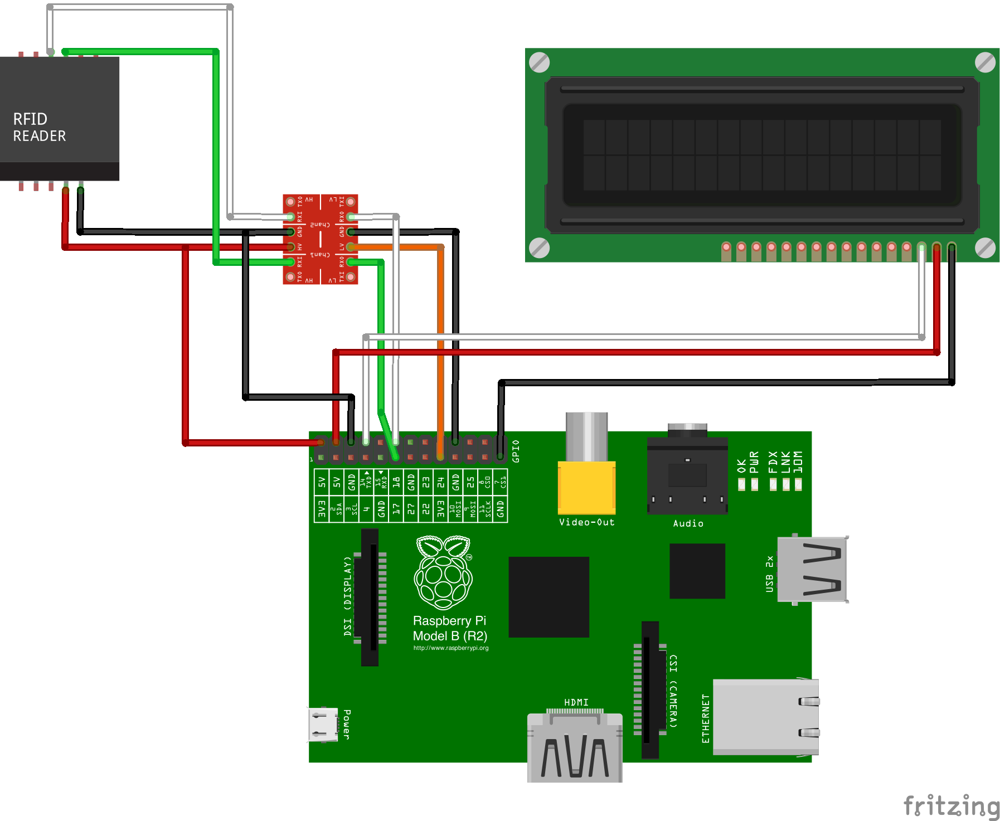

RFID-Checkout Client is an Archived Project
=============================

RFID-Checkout Client is no longer actively maintained. Your mileage with patches may vary.

RFID-Checkout Client
===================

This is the front end code to run an RFID based check out/in library system. The code should run on a Raspberry Pi with a compatible Low Frequency RFID reader attached to its GPIO pins. This is only the client side code. Remote endpoints are required for retrieving device information and storing status (refer to Server Side Setup below).

Usage
-----

1. Start the client software once the RFID reader is connected to system (see Requirements)

      sudo python hid_reader.py

2. Touch either a human/staff or device tag to the reader. If a human badge was tapped first, then tap a device to check out within 60 seconds (default can be changed in Tag_handler). If you take longer than this amount of time, you will need to re-tap the first tag. The LCD screen should display the results of each tap and the checkout process.

3. If the human/staff tag is unknown to the backend system, the user will be prompted to enter their name via the attached USB Keyboard. The back end should store this value so that it only needs to be requested once from the user.

Requirements
------------
NOTE: MAKE SURE TO CONVERT THE 5 VOLT SIGNAL TO THE RASPI TO 3.3 VOLTS BEFORE POWERING ON THE SYSTEM (Most card readers pull the line high, so even if not reading a card, it will send a 5 volt signal that can damage the RasPi)

1. The RFID Reader should be connected to the RasPi via GPIO (BCM) pins 17 and 18. Using a proper power supply to the RasPi, the 5 Volt out pin should be able to power the reader directly.

From the RFID Reader to the RasPi

      red/vcc -> pin 2
      black/ground -> pin 25
      green/data0 -> pin 17 (after voltage conversion)
      white/data1 -> pin 18 (after voltage conversion)

2. Connect the USB Keyboard and serial LCD screen (either over USB, or using GPIO 14). Install the pyserial library. 

      sudo pip install pyserial
      
3. Install the raspberry-gpio-python library.

      sudo apt-get install python-rpi.gpio

4. Install the WiringPi library. Download and instructions at: http://wiringpi.com

5. Run "make" in order to create the hid_gpio_reader binary. You can then test out the card reader code with 

      sudo ./hid_gpio_reader

6. Run the main application (sudo required for GPIO access)

      sudo python ./hid_reader.py 

Parts List
----------
 * Raspberry PI
 * SDCard for Raspberry PI OS: [tested with Raspbian - Wheezy] (http://www.raspberrypi.org/downloads/)
 * [5v to 3.3v converter] (https://www.sparkfun.com/products/12009) 
 * [5v Serial LCD 16x2] (https://www.sparkfun.com/products/9395)
 * Site Compatible RFID Reader 
 * USB Keyboard

Server Side Setup
-----------------

The server will need to implement the following API calls. These are defined in the Tag_handler.

 * CHECKINOUT_ENDPOINT  - takes two RFID tag values (staff_rfid_tag,asset_rfid_tag) and checks in or out the device to the staff member
  * Return Value Example: {"response":"Corey checked out iPod Touch 5th Generation"}
  * Return Value Example: {"response":"Corey checked in iPod Touch 5th Generation"}
  * Return Value Example: {"error":"Unknown Device"}

 * WHATIS_ENDPOINT - Takes one RFID tag value (rfid) and returns a text based name of the associated device or staff member 
  * Return Value Example: {"type":"human","name":"C Benninger"}
  *  Return Value Example: {"type":"device","name":"iPad Mini G1 (inky)"}
  *  Return Value Example: {"error":"RFID did not match known values"}

 * ADDHUMAN_ENDPOINT - Takes one RFID tag value (tag) and one staff member name (who). This associates the tag with the end user
  * Return Value Example: {"msg":"Tag associated with C Benninger"}
  * Return Value Example: {"error":"User Not Found"}
